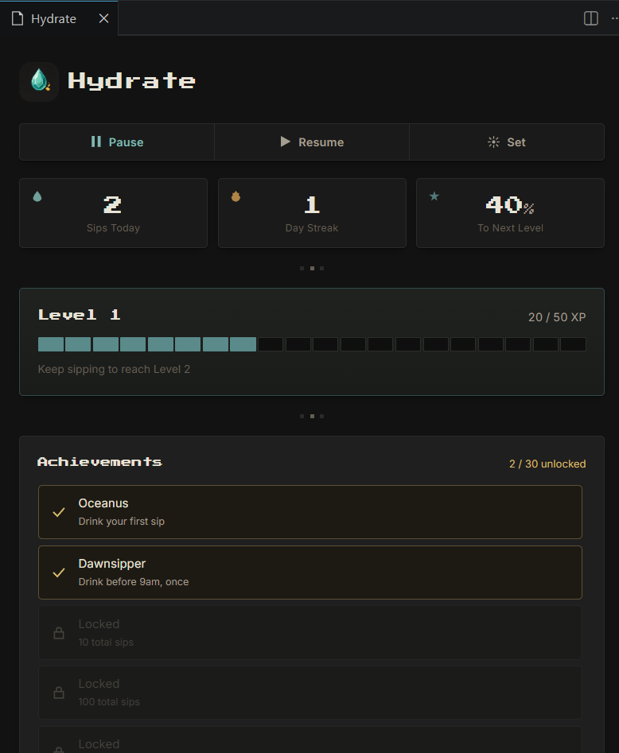
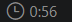
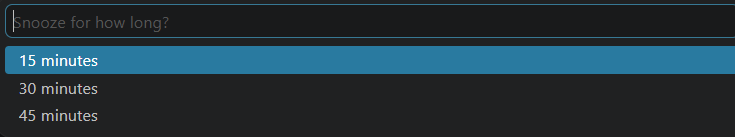
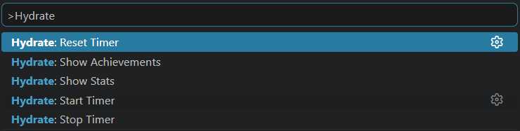
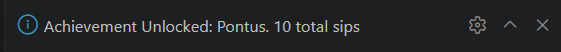
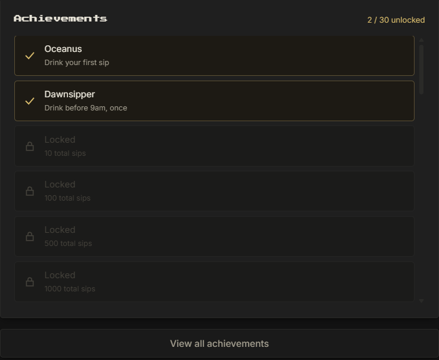

#  Hydrate

Stay hydrated while you code. Hydrate reminds you to drink water on your own schedule, then turns every sip into XP, streaks, and unlockable achievements — right inside VS Code.

## Features

- **Smart reminders** — choose how often you're reminded and what the message says
- **Snooze, your way** — push a reminder back 15, 30, or 45 minutes
- **XP & Levels** — every sip earns XP; levels scale infinitely, so there's always a next one
- **Streaks** — build a daily streak, and keep an eye on your all-time best
- **30 achievements** — mythology-inspired milestones across sips, streaks, levels, time of day, and snooze discipline
- **Dashboard** — a small retro-styled panel showing your stats, XP progress, and achievements at a glance
- **Status bar countdown** — always know how long until your next reminder

## Getting started

1. Install the extension
2. A reminder will appear automatically based on your interval setting (default: every 60 minutes)
3. Click **Done** when you drink, or **Snooze** to push it back
4. Click the countdown in the status bar to open your dashboard

Snoozing lets you pick exactly how long to wait:

## Dashboard

Click the status bar item (bottom of your VS Code window) to open the Hydrate dashboard:

- **Sips today**, **day streak**, and **progress to next level** at a glance
- An XP bar showing your current level and progress
- Your unlocked achievements, with locked ones shown alongside what's needed to earn them
- Quick **Pause**, **Resume**, and **Set Interval** controls — no need to dig into settings

## Commands

Open the Command Palette (`Ctrl+Shift+P` / `Cmd+Shift+P`) and search for:

| Command | Description |
|---|---|
| `Hydrate: Start Timer` | Start hydration reminders |
| `Hydrate: Stop Timer` | Stop hydration reminders |
| `Hydrate: Reset Timer` | Restart the countdown to your next reminder |
| `Hydrate: Show Stats` | Open the dashboard |
| `Hydrate: Show Achievements` | View your achievement progress in a quick list |

## Settings

Search for **"Hydrate"** in VS Code Settings (`Ctrl+,` / `Cmd+,`):

| Setting | Default | Description |
|---|---|---|
| `hydrate.reminderInterval` | `60` | How often you're reminded, in minutes |
| `hydrate.reminderMessage` | `Time to hydrate!` | The message shown in each reminder |

## How XP and levels work

Every sip earns **10 XP**. The XP needed for each level increases gradually, so early levels come quickly and later ones become a longer-term goal. There's no level cap.

## How streaks work

Drinking at least once in a day keeps your streak alive. Miss a full day, and it resets — but your **best streak ever** is always saved separately, so your top achievement stays unlocked even if your current streak breaks.

## Achievements

Thirty achievements span five categories: total sips, streaks, levels, early/late drinking habits, and snooze discipline. Some are serious milestones, a couple are just for fun. Unlock them by using Hydrate naturally — there's no separate tracking required.

Unlocking one shows up right where you're already working:

## Privacy

Hydrate stores all of your stats locally on your machine using VS Code's built-in storage. Nothing is sent anywhere.

## Feedback

Found a bug or have an idea? Open an issue on [GitHub](https://github.com/PratikP06/Hydrate).

---

Stay hydrated. Keep coding.